# ui

> 一些UI设计。经常看到生活中一些好玩的东西， 有的是突发奇想的设计，有的是看到一些好的设计后，不禁感叹：作者是如何做出这么好的设计来的呢？于是，有了下面的内容。
> 以下的内容基本上都是通过纯CSS的方式实现的，有少量的js，也很少依赖高级js库，代码简单易懂。

**看不到图片请移步[https://gitee.com/shoppingzh/ui](https://gitee.com/shoppingzh/ui)**

## Apple watch系列

#### 1. apple watch 表盘
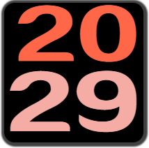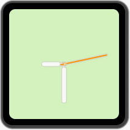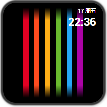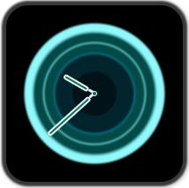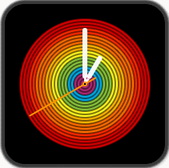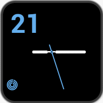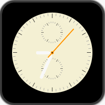

#### 2. apple watch 应用
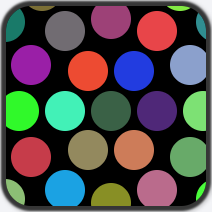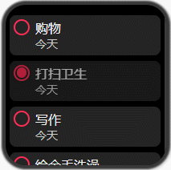

## 阴影系列

#### 1. Android卡片阴影效果
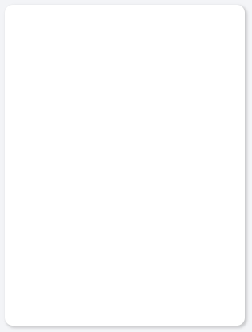

#### 2. 单标签实现彩虹圆环
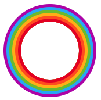

## 占位系列
#### 1. youtube首页占位效果（动画）
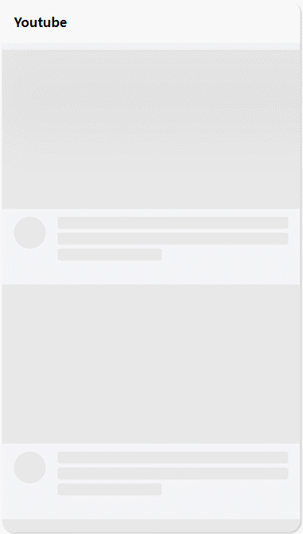

#### 2. 通用首页占位

## 其它

#### 仿饿了么首页的宣传卡片效果
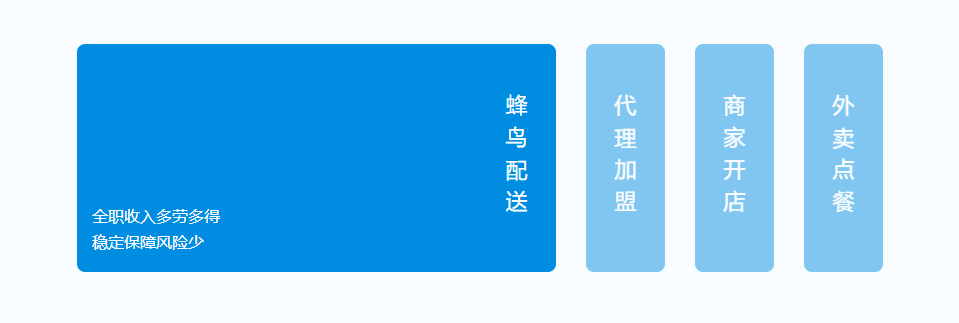

#### 防抖-节流可视化UI
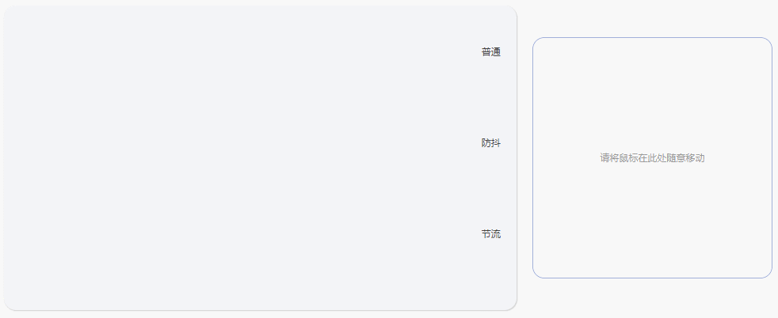

#### 365 Dots
> 365 Dots是iOS的一个应用，用来展示当前一年走过的时间。

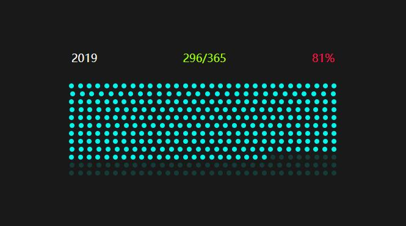

#### css八卦
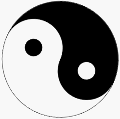

#### card flip

#### 仿微信网络错误页面
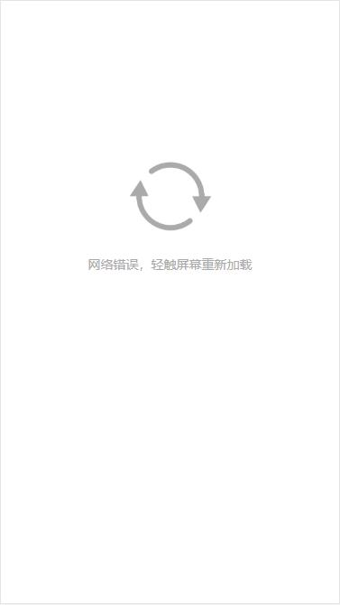

#### 纯css实现tooltip
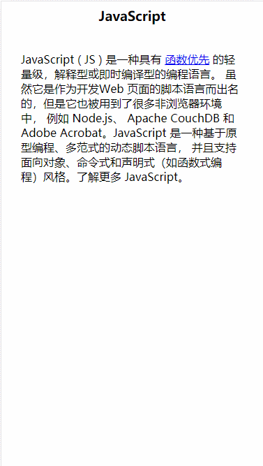

#### css实现的加载动画
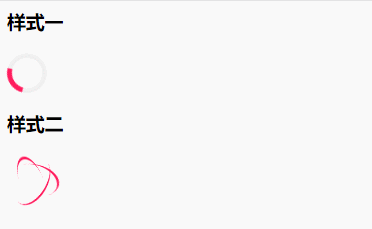

#### 仿iPhone桌面搜索
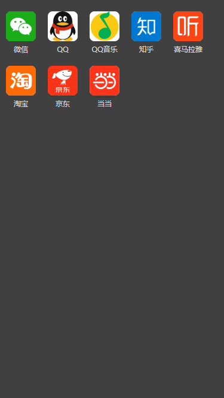

#### 仿微信webview底部操作栏滚动效果
