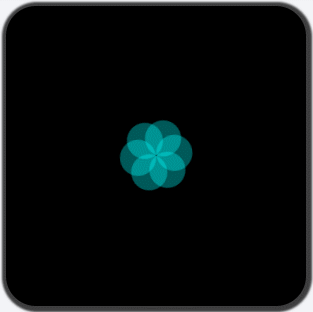

# ui

> 一些UI设计。经常看到生活中一些好玩的东西， 有的是突发奇想的设计，有的是看到一些好的设计后，不禁感叹：作者是如何做出这么好的设计来的呢？于是，有了下面的内容。
> 以下的内容基本上都是通过纯CSS的方式实现的，有少量的js，也很少依赖高级js库，代码简单易懂。

## Apple watch系列

#### apple watch 表盘

#### apple watch 呼吸

## 其它

#### 365 Dots
> 365 Dots是iOS的一个应用，用来展示当前一年走过的时间。

#### css八卦

#### card flip

#### 访微信网络错误页面

#### 首页展位效果

#### 纯css实现tooltip

#### css实现的加载动画

#### 仿iPhone桌面搜索

#### 仿微信webview底部操作栏滚动效果
